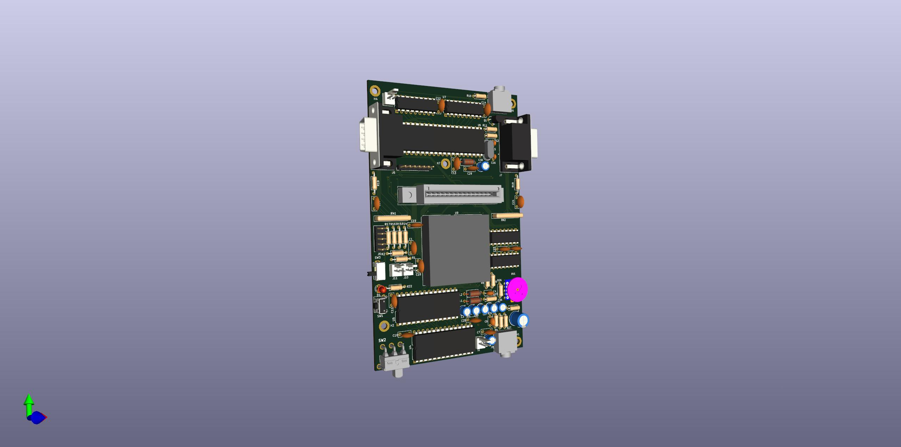

# Mini Colecovision Project with Super Game Module Support
### Schematic, PCB, and CPLD design.

---

  author: Jay Convertino

  date: 2024.03.24

  details: A Super Game Module Compatible Colecovision that is much smaller than the original, and only uses +5v.

  license: MIT

---

## LICENSE
  - All files related to or generated from the KiCAD source fall under the MIT license.
  - All files related to or generated from the Verilog source fall under the MIT license.
  - All files generated by me, Jay Convertino, fall under the MIT license.
  - All files from other sources fall under the license of their specification.

## RELEASE VERSIONS
### Current
  - 1.0.0 - First working version

### Past
  - DEV

## Wiki
  - Soon(tm)
  - Will include a detailed parts list, better than the general one below.

## Parts list
| COMPONENT NUMBER | VALUE |
|------------------|   ---:|
|C1, C7, C8, C10, C11, C12, C13, C14, C18, C19, C23, C25, C29| 100nF |
|C2 | 330uF |
|C3, C5, C24, C30 | 10uF |
|C4 | 100pF |
|C6 | 270pF |
|C9, C17, C22 | 100nF |
|C15, C16 | 33pF |
|C20, C21 | 10nF |
|C26 | 0.47uF |
|C27 | 0.1uF |
|C28 | 2.2uF |
|D1 | LED |
|J1 | Conn_01x07 |
|J2, J10, J11 | Conn_01x02 |
|J3 | Conn_Coaxial |
|J4 | 5530841-2 |
|J5 | DSUB-9_Male_Horizontal |
|J6 | Conn_02x05_Odd_Even |
|J7 | DSUB-9_Male_Horizontal |
|J8, J9 | SJ1-3525NG |
|L1, L2, L3 | 4.7uH |
|Q1 | 2N3904 |
|R1 | 4k7 |
|R2 | 470R |
|R4, R27 | 100K |
|R5, R6 | 2k2 |
|R7, R8, R9 | 3K3 |
|R10 | 75R |
|R11 | 510R |
|R12 | 100R |
|R13 | 3k3 |
|R14, R15, R16, R17 | 1k |
|R18, R19 | 10k |
|R20 | 1K |
|R21	| 1k |
|R22 | 220R |
|R23 | 10K |
|R24, R26 | 1K |
|R25 | 68K |
|RN1, RN2 | 10k |
|RV1 | 10K |
|SW1 | MICRO RIGHT ANGLE |
|SW2 | SW_SPDT |
|SW3 | SW_SPDT |
|U1 | TPA711D |
|U2 | SN76489AN |
|U3 | Z84C0010AEG |
|U4 | CY62256-55PC |
|U5 | 27C256 |
|U6 | TMS9118NL |
|U7, U8 | TMS4416 |
|U9 | EPM7128SLC |
|U10 | 74ABT125 |
|U11 | YMZ284 |
|Y1 | 10.738635 MHz Crystal |
|J12 | 5530841-2 |

## Intro
  This is a miniturization of the original colecovision. All logic is simplified to a single CPLD.

## SOURCES
### Schematic Check
  - Righteous Tentacle Colecovision : https://github.com/sparkletron/righteous_tentacle_colecovision : Jay Convertino

## REQUIREMENTS
  - KiCAD v7.X
  - Quartus v13.0.1sp1 web edition
  - Altera USB Blaster

## BUILD TIPS
  This design is made so anyone can build this. Though it will need a board from a PCB manufacture due to the small pitch and
  vias. There are only a few SMD devices, the CPU, a cap, and a few resistors. These are larger to help make soldering easier.

  Recommend populating the SMD parts first, then moving on to the through hole parts from passive to active. If you do not plan
  on using a battery pack the shotkey diodes can be omitted.

  This is a 4 layer board, also no CAD files for the case will be released in this repository.

## FILE INFORMATION
  - README.md, is this file.
  - LICENSE.md, is the license file (MIT) for anything create by me, Jay Convertion, that resides in this repository.
  - doc, contains various documents used.
    - datasheets, contains parts used on the board.
  - models, PCB items and case designes (soon)
  - pics, images take by me or others(watermark added) of the colecovision.
    - 3D, images generated by modeling tools.
  - src, Verilog source for CPLD
    - protable_coleco, contains verilog source, test bench and fusesoc core file.
    - quartus13sp01, contains quartus project for MAX7000 series CPLD
      - bin, contains CPLD firmware for varous compatible chips.
  - schematic, contains KiCAD schematic files.
    - coleco_original.kicad_pro, this file is the main project file that contains EVERTHING.
    - gerber, containts all exports from KiCAD
    - lib, external components for KiCAD
      - CONNECTOR_PCBEdge_EXT
      - LOGOS
      - MHPS2273
      - MODELS
      - MOUNTS
      - OS102011MA1QN1
      - PADS
      - POWER_SYMBOLS
      - RCJ-041
      - RF_MODULATORS
      - SWITCHES_THT
      - TE_550841-2
      - VARIABLE_INDUCTORS
      - VINTAGE_AUDIO_SYNTH
      - VINTAGE_RAM
      - VINTAGE_VDP
    - PDF, various KiCAD exports in the PDF format. PCB and/or schematics.

## PCB IMAGE

